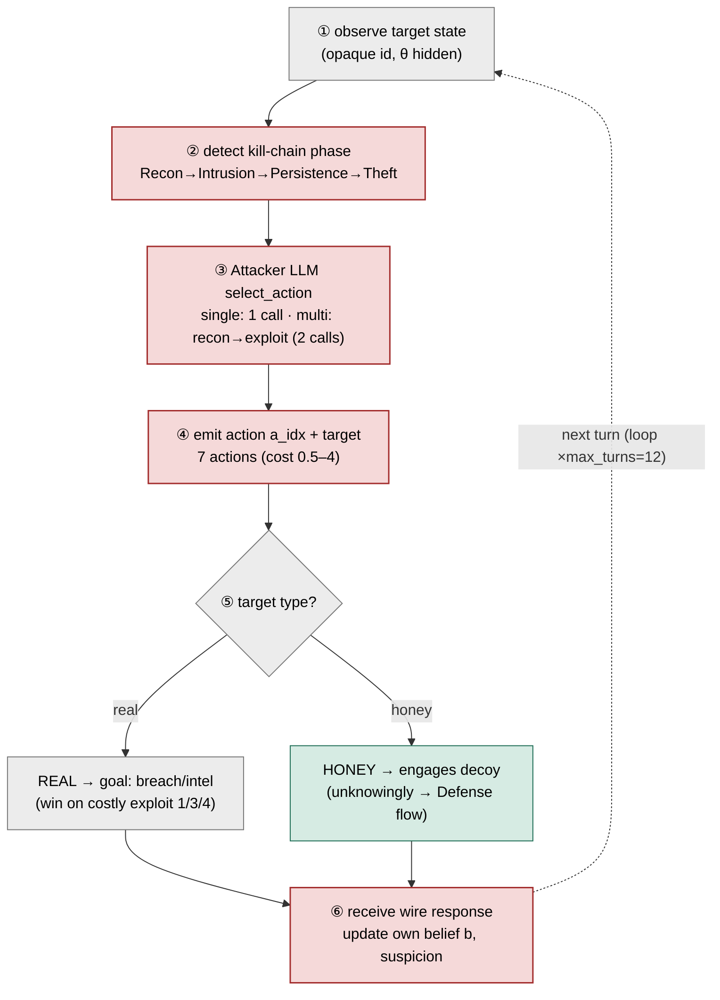
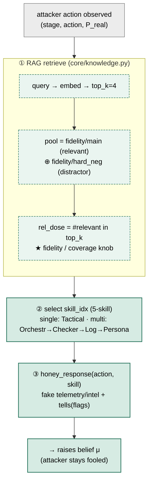
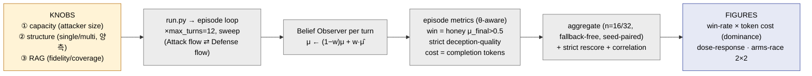

# ARCHITECTURE — Mermaid (논문 figure용, 렌더 가능)

각 코드블록을 mermaid.live · VS Code(Markdown Preview Mermaid) · GitHub에서 **벡터 그림으로 바로 렌더** → SVG 추출 후 IEEE figure로.
색: Attacker=brick(빨강) · Deception=teal(초록) · 중립(FANET/GCS/real/Observer)=gray. "Deceiver" 미사용.

---

## FIG A — FANET ENVIRONMENT (배경 무대)
> 물리 토폴로지: 1 GCS · 2 real · 2 honey(Deception LLM 탑재) · 1 attacker. star/static/150m. real↔honey wire 구분불가.

```mermaid
graph TD
  classDef atk fill:#F5D9D9,stroke:#A32D2D,stroke-width:1.5px,color:#000
  classDef dec fill:#D6EBE3,stroke:#1F6E56,stroke-width:1.5px,color:#000
  classDef neu fill:#ECECEC,stroke:#777,stroke-width:1.2px,color:#000

  GCS["GCS (star hub)"]:::neu
  R0["real drone 0<br/>θ=real · protected"]:::neu
  R1["real drone 1<br/>θ=real · protected"]:::neu
  H0["honeydrone 0<br/>θ=honey · Deception LLM 7B"]:::dec
  H1["honeydrone 1<br/>θ=honey · Deception LLM 7B"]:::dec
  ATK["Attacker LLM<br/>Qwen2.5 0.5–14B"]:::atk

  GCS --- R0
  GCS --- R1
  GCS --- H0
  GCS --- H1
  ATK -. "range ≤150m (MAVLink, no GCS link)" .- H0
  ATK -. "real↔honey WIRE-INDISTINCT" .- R0
  ATK -. .- H1

  %% fanet/{nodes,topology=star,routing=shortest_path,mobility=static} · config/default.yaml
```

---

## FIG B — ATTACK FLOW (공격자, per-turn 순서)
> Attacker LLM이 kill-chain을 따라 행동을 고르는 흐름. single=1 LLM, multi=recon-analyst→exploit-operator.



---

## FIG C — DEFENSE FLOW (Deception LLM, per-engagement 순서)
> 허니드론 두뇌가 공격 행동을 받아 belief μ를 높게 유지하는 흐름. ①RAG→②skill→③wire.



---

## FIG D — RESULTS PIPELINE (결과 도출 순서)
> 노브 → 에피소드 루프 → per-turn belief/cost → 에피소드 지표 → 집계 → figure.



---

## 렌더 / 이식 노트
- **렌더**: mermaid.live 붙여넣기 → Export SVG/PNG. 또는 VS Code "Markdown Preview Mermaid Support". GitHub은 ```mermaid 자동 렌더.
- **IEEE 이식**: SVG를 그대로 vector figure로 쓰거나, 배치 확정 후 TikZ로 옮김(노드/엣지가 단순해 직역 쉬움).
- **4장 역할**: A=무대(배경), B=공격 순서, C=방어 순서, D=결과 도출 — 본문에서 A 먼저, B·C 나란히(대칭), D는 방법/결과 연결부.
- 색 classDef(atk/dec/neu)는 4장 공통 → 일관성 유지.
